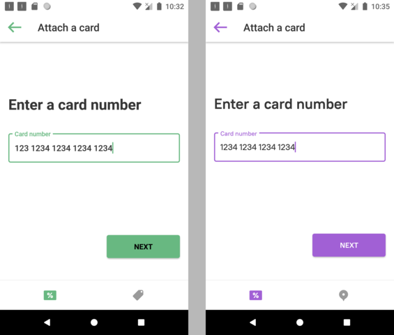

# Context
This sample project illustrates a systematic approach towards building a White Label android solution. 
It accompanies an article which describes all major decisions in great detail:
* in russian (habr, TBD)
* in english (TBD)

Initially this approach was designed for the "Loyaka" system by Dmitry Alexeenkoff and myself, while working for the "LiveTyping" studios.

# App features
This app is a greatly reduced version of the real Loyaka. The goal was to provide the minimum amount of features to 
give a comprehensive understanding of the mechanism. 

## General
As described in the article, to create a new app one needs to add a new flavor script and set it up, that includes:
* **providing a config** — select modules, a start screen and specific screen's features.
* **branding** — override resources such as colors and images in a flavor specific folder.

## Screens
Here we only have one functional module — loyalty, it includes screens:
1. **Enter user id** — a stub for authorization. Can be configured to accept either email or a phone number. 

2. **No card** — a user is authorized, but has no cards. He is offered to attach one via available methods. 

3. **Attach a card** — a user has a plastic card and wants to attach it to the app. Card number's mask can be configured.

4. **Generate a card** — a user doesn't have a card and wants to create one. All required fields are configurable. 

5. **Card Info** — a user wants to check their card balance. UI is adapting to the available data as loyalty programs can be quite different.

# Implementation 

Details can be found in the article, here I'll just highlight a few key points.

## General

* **Architecture** — single module with organization by layers via the Clean Architecture approach, UI layer via MVVM;
* **White Label** — codebase reuse mechanism via Gradle Product Flavors, configs via Gradle BuildConfig;
* **Flows** — for the sake of simplicity all exception handling and loadings were cut out *(some non—relevant features
like sms—confirmation were also left out)*.

## Tech stack
Pretty standard, nothing curious:
* Language: Kotlin
* SDK & views: AndroidX
* Navigation: Cicerone
* Concurrency: Coroutines
* Service locator: Koin
* Network: Okhttp + Retrofit
* Images: Glide
* Other libs for small specific tasks like barcode.